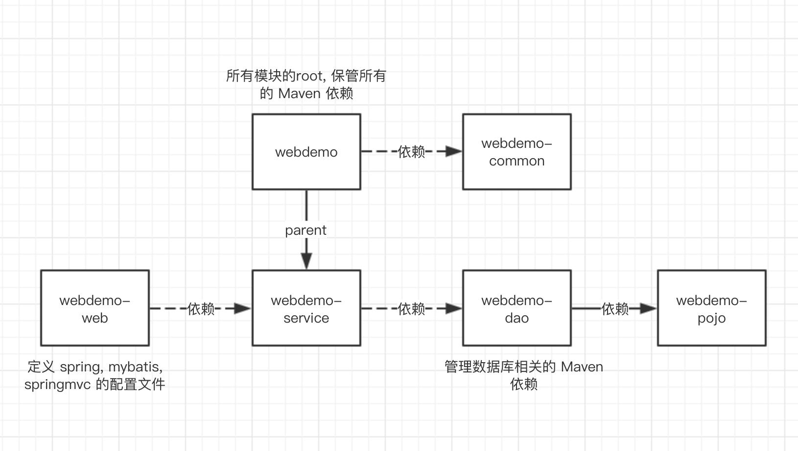
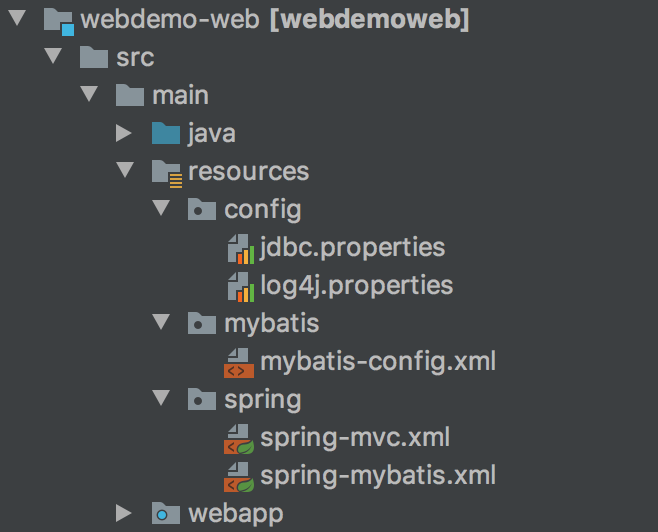

# 使用 Maven 构建多模块的 web 应用

> [参考的 Maven多模块部署文章](<https://www.leeyom.top/2017/08/01/tech-maven-multi-module-ssm/>)

[TOC]

# 1. 模块分层

主要思想就是利用 Maven 工程,  将原来的单个 web 应用分离开来, 变为一个一个模块, 从而实现 **低耦合, 高内聚**

在此 demo 中, 我们将原本的一个单体 web app, 分割为如下几个模块 : 

*  [jar] webdemo-common : 存放公共工具
*  [jar] webdemo-dao : 持久层模块
*  [jar] webdemo-pojo : 对应数据库的实体 POJO 类
*  [jar] webdemo-servce : 逻辑业务层模块
*  [war] webdemo-web : web 交互模块, 打包为 war包

整体目录结构如下 : 

~~~
ssm-demo
├── ssm-common -- 公共模块，主要存放一些工具类
|    ├── src
|    ├── pom.xml -- 打包方式：jar
├── ssm-dao -- 存放mybatis相关的mapper接口
|    ├── src
|    ├── pom.xml -- 打包方式：jar
├── ssm-pojo -- 存放实体类
|    ├── src
|    ├── pom.xml -- 打包方式：jar
├── ssm-service -- 存放业务逻辑类
|    ├── src
|    ├── pom.xml -- 打包方式：jar
├── ssm-web -- 存放前台页面，客户端交互相关的controller
|    ├── src
|    ├── pom.xml -- 打包方式：war
├── pom.xml --打包方式为pom，一些公用的依赖
~~~

各个模块之间的依赖关系如下 : 

# 2. 构建步骤

* 首先在 IDEA 中 创建一个 空 Maven 工程, 然后删除里面的 **src** 目录, 从而将这个Maven 工程作为 root.

  在该 maven 工程的 pom.xml 文件中, 添加Spring, MyBatis, Springmvc 等相关的依赖  :

* 选择 New model 并创建 Maven 工程, 依次的创建出 webdemo-web, webdemo-service, webdemo-dao,webdemo-pojo, webdemo-common

* 由于仅有 **webdemo-service** 是继承了 webdemo, 所以将除了 webdemo-service 的其他模块的 pom.xml 文件的 \<parent> 标签删除

* 由于 webdemo-web 的打包方式为 web 包, 所以我们重新构建 webdemo - web :

  右键webdemo-web --> open model setting --> 选择 webdemo-web 为一个 webapplication --> apply

至此, 我们的各个模块创建完成.

# 3. 添加各模块依赖

在创建好我们的各个模块之后, 我们需要在各个模块的 pom.xml 文件中, 添加各个模块之间的依赖, **从而可以实现有依赖模块之间的相互引用** : 

例如 : webdemo-web 依赖与 webdemo-service, 则在 pom.xml 文件中应该如下写

~~~xml
<!--添加 webdemo-web module依赖-->
<dependency>
    <groupId>com.arkssss.webdemo</groupId>
    <artifactId>webdemo-service</artifactId>
    <version>1.0-SNAPSHOT</version>
</dependency>
~~~

依次类推, 根据依赖关系图, 添加依赖

# 4. Springmvc, Spring, Mybatis 的配置XML

我们将所有的配置文件均放置于 webdemo-web 模块下 : 

# 5. 配置文件内容

## web.xml

~~~xml
<?xml version="1.0" encoding="UTF-8"?>
<web-app xmlns:xsi="http://www.w3.org/2001/XMLSchema-instance"
         xmlns="http://java.sun.com/xml/ns/javaee"
         xsi:schemaLocation="http://java.sun.com/xml/ns/javaee http://java.sun.com/xml/ns/javaee/web-app_3_0.xsd"
         version="3.0">
    <display-name>webdemo</display-name>

    <!-- Spring和mybatis的配置文件 -->
    <context-param>
        <param-name>contextConfigLocation</param-name>
        <param-value>classpath:spring/spring-mybatis.xml</param-value>
    </context-param>

    <!-- 编码过滤器 -->
    <filter>
        <filter-name>encodingFilter</filter-name>
        <filter-class>org.springframework.web.filter.CharacterEncodingFilter</filter-class>
        <async-supported>true</async-supported>
        <init-param>
            <param-name>encoding</param-name>
            <param-value>UTF-8</param-value>
        </init-param>
    </filter>
    <filter-mapping>
        <filter-name>encodingFilter</filter-name>
        <url-pattern>/*</url-pattern>
    </filter-mapping>

    <!-- Spring监听器 -->
    <listener>
        <listener-class>org.springframework.web.context.ContextLoaderListener</listener-class>
    </listener>

    <!-- 防止Spring内存溢出监听器 -->
    <listener>
        <listener-class>org.springframework.web.util.IntrospectorCleanupListener</listener-class>
    </listener>

    <!-- Spring MVC -->
    <servlet>
        <servlet-name>SpringMVC</servlet-name>
        <servlet-class>org.springframework.web.servlet.DispatcherServlet</servlet-class>
        <init-param>
            <param-name>contextConfigLocation</param-name>
            <param-value>classpath:spring/spring-mvc.xml</param-value>
        </init-param>
        <load-on-startup>1</load-on-startup>
        <async-supported>true</async-supported>
    </servlet>
    <servlet-mapping>
        <servlet-name>SpringMVC</servlet-name>
        <url-pattern>/</url-pattern>
    </servlet-mapping>
    <welcome-file-list>
        <welcome-file>/index.jsp</welcome-file>
    </welcome-file-list>
</web-app>
~~~

## spring-mvc.xml

~~~xml
<?xml version="1.0" encoding="UTF-8"?>
<beans xmlns="http://www.springframework.org/schema/beans"
       xmlns:xsi="http://www.w3.org/2001/XMLSchema-instance"
       xmlns:context="http://www.springframework.org/schema/context"
       xmlns:mvc="http://www.springframework.org/schema/mvc"
       xsi:schemaLocation="http://www.springframework.org/schema/beans http://www.springframework.org/schema/beans/spring-beans.xsd http://www.springframework.org/schema/context http://www.springframework.org/schema/context/spring-context.xsd http://www.springframework.org/schema/mvc http://www.springframework.org/schema/mvc/spring-mvc.xsd">

    <!-- 自动装配 -->
    <context:component-scan base-package="com.arkssss.controller" use-default-filters="false">
        <context:include-filter type="annotation" expression="org.springframework.stereotype.Controller"/>
        <context:include-filter type="annotation" expression="org.springframework.web.bind.annotation.ControllerAdvice"/>
    </context:component-scan>

    <!--视图解析器-->
    <bean class="org.springframework.web.servlet.view.InternalResourceViewResolver">
        <!--前缀-->
        <property name="prefix" value="/WEB-INF/"/>
        <!--后缀-->
        <property name="suffix" value=".jsp"></property>
    </bean>

    <!-- 文件上传 -->
    <bean id="multipartResolver"
          class="org.springframework.web.multipart.commons.CommonsMultipartResolver">
        <!-- 默认编码 -->
        <property name="defaultEncoding" value="utf-8"/>
        <!-- 文件大小最大值 -->
        <property name="maxUploadSize" value="10485760000"/>
        <!-- 内存中的最大值 -->
        <property name="maxInMemorySize" value="40960"/>
    </bean>

    <!--启用该标签代表 spring mvc 不拦截css、js、jpg等相关的静态资源-->
    <mvc:default-servlet-handler/>

    <!-- 启用spring mvc 注解 -->
    <mvc:annotation-driven></mvc:annotation-driven>
</beans>
~~~

## spring-mybatis.xml

~~~xml
<?xml version="1.0" encoding="UTF-8"?>
<beans xmlns="http://www.springframework.org/schema/beans"
       xmlns:xsi="http://www.w3.org/2001/XMLSchema-instance"
       xmlns:context="http://www.springframework.org/schema/context" xmlns:tx="http://www.springframework.org/schema/tx"
       xsi:schemaLocation="http://www.springframework.org/schema/beans
                        http://www.springframework.org/schema/beans/spring-beans-3.1.xsd
                        http://www.springframework.org/schema/context
                        http://www.springframework.org/schema/context/spring-context-3.1.xsd http://www.springframework.org/schema/tx http://www.springframework.org/schema/tx/spring-tx.xsd">
    <!-- 自动扫描 -->
    <context:component-scan base-package="com.arkssss"/>

    <!-- 加载外部属性配置文件 -->
    <bean id="propertyPlaceholderConfigurer"
          class="org.springframework.beans.factory.config.PropertyPlaceholderConfigurer">
        <property name="locations" value="classpath:config/jdbc.properties"/>
    </bean>

    <!-- 配置C3P0数据源 -->
    <bean id="dataSource" class="com.mchange.v2.c3p0.ComboPooledDataSource">
        <property name="driverClass" value="${jdbc.driver}"/>
        <property name="jdbcUrl" value="${jdbc.url}"/>
        <property name="user" value="${jdbc.user}"/>
        <property name="password" value="${jdbc.password}"/>
    </bean>

    <bean id="sqlSessionFactory" class="org.mybatis.spring.SqlSessionFactoryBean">
        <property name="configLocation" value="classpath:mybatis/mybatis-config.xml"></property>
        <property name="dataSource" ref="dataSource"></property>
        <property name="mapperLocations">
            <list>
                <value>classpath*:mybatis/mapper-*.xml</value>
            </list>
        </property>

    </bean>

    <!-- DAO接口所在包名，Spring会自动查找其下的类 -->
    <!-- 将DAO接口映射为 Bean 实例  -->
    <bean class="org.mybatis.spring.mapper.MapperScannerConfigurer">
        <property name="basePackage" value="com.arkssss.dao"/>
        <property name="sqlSessionFactoryBeanName" value="sqlSessionFactory"></property>
    </bean>

    <!-- 事务管理器 -->
    <bean id="transactionManager" class="org.springframework.jdbc.datasource.DataSourceTransactionManager">
        <property name="dataSource" ref="dataSource"/>
    </bean>
</beans>
~~~

## mybatis-config.xml

~~~xml
<?xml version="1.0" encoding="UTF-8"?>
<!DOCTYPE configuration PUBLIC "-//mybatis.org//DTD Config 3.0//EN" "http://mybatis.org/dtd/mybatis-3-config.dtd">
<configuration>

</configuration>
~~~

## mapper-user.xml

~~~xml
<?xml version="1.0" encoding="UTF-8" ?>
<!DOCTYPE mapper PUBLIC "-//mybatis.org//DTD Mapper 3.0//EN" "http://mybatis.org/dtd/mybatis-3-mapper.dtd" >
<mapper namespace="com.arkssss.dao.user.UserMapper">

    <select id="getUserById" parameterType="Integer" resultType="com.arkssss.pojo.User">
        select * from user where id = #{id}
    </select>

</mapper>
~~~

# 6.POM 文件

## webdemo 根pom

~~~xml
<?xml version="1.0" encoding="UTF-8"?>
<project xmlns="http://maven.apache.org/POM/4.0.0"
         xmlns:xsi="http://www.w3.org/2001/XMLSchema-instance"
         xsi:schemaLocation="http://maven.apache.org/POM/4.0.0 http://maven.apache.org/xsd/maven-4.0.0.xsd">
    <modelVersion>4.0.0</modelVersion>

    <groupId>com.arkssss.webdemo</groupId>
    <artifactId>webdemo</artifactId>
    <packaging>pom</packaging>
    <version>1.0-SNAPSHOT</version>

    <!--聚合的子module，父级的pom聚合他下面的所有的子模块，而子模块可以继承父级pom里面的依赖，这就是maven的聚合与继承-->
    <modules>
        <module>webdemo-common</module>
        <module>webdemo-web</module>
        <module>webdemo-service</module>
        <module>webdemo-dao</module>
        <module>webdemo-pojo</module>
    </modules>

    <properties>
        <!--jar包版本控制-->
        <spring.version>4.1.7.RELEASE</spring.version>
        <slf4j.version>1.7.7</slf4j.version>
        <log4j.version>1.2.17</log4j.version>
        <json-lib.version>2.4</json-lib.version>
        <junit.version>4.9</junit.version>
        <fastjson.version>1.2.35</fastjson.version>
        <gson.version>2.2.4</gson.version>
        <commons-lang3.version>3.3.2</commons-lang3.version>

        <!--编译级别-->
        <project.build.sourceEncoding>UTF-8</project.build.sourceEncoding>
        <maven.compiler.source>1.8</maven.compiler.source>
        <maven.compiler.target>1.8</maven.compiler.target>
        <maven.compiler.compilerVersion>1.8</maven.compiler.compilerVersion>
    </properties>

    <dependencies>

        <!--共用模块-->
        <dependency>
            <groupId>com.arkssss.webdemo</groupId>
            <artifactId>webdemo-common</artifactId>
            <version>1.0-SNAPSHOT</version>
        </dependency>

        <!--spring核心包-->
        <dependency>
            <groupId>org.springframework</groupId>
            <artifactId>spring-core</artifactId>
            <version>${spring.version}</version>
        </dependency>

        <dependency>
            <groupId>org.springframework</groupId>
            <artifactId>spring-beans</artifactId>
            <version>${spring.version}</version>
        </dependency>

        <dependency>
            <groupId>org.springframework</groupId>
            <artifactId>spring-web</artifactId>
            <version>${spring.version}</version>
        </dependency>

        <dependency>
            <groupId>org.springframework</groupId>
            <artifactId>spring-webmvc</artifactId>
            <version>${spring.version}</version>
        </dependency>

        <dependency>
            <groupId>org.springframework</groupId>
            <artifactId>spring-oxm</artifactId>
            <version>${spring.version}</version>
        </dependency>

        <dependency>
            <groupId>org.springframework</groupId>
            <artifactId>spring-tx</artifactId>
            <version>${spring.version}</version>
        </dependency>

        <dependency>
            <groupId>org.springframework</groupId>
            <artifactId>spring-orm</artifactId>
            <version>${spring.version}</version>
        </dependency>

        <dependency>
            <groupId>org.springframework</groupId>
            <artifactId>spring-jdbc</artifactId>
            <version>${spring.version}</version>
        </dependency>

        <dependency>
            <groupId>org.springframework</groupId>
            <artifactId>spring-context</artifactId>
            <version>${spring.version}</version>
        </dependency>

        <dependency>
            <groupId>org.springframework</groupId>
            <artifactId>spring-context-support</artifactId>
            <version>${spring.version}</version>
        </dependency>

        <dependency>
            <groupId>org.springframework</groupId>
            <artifactId>spring-test</artifactId>
            <version>${spring.version}</version>
        </dependency>

        <dependency>
            <groupId>org.springframework</groupId>
            <artifactId>spring-aspects</artifactId>
            <version>${spring.version}</version>
        </dependency>

        <dependency>
            <groupId>org.springframework</groupId>
            <artifactId>spring-aop</artifactId>
            <version>${spring.version}</version>
        </dependency>

        <!--单元测试-->
        <dependency>
            <groupId>junit</groupId>
            <artifactId>junit</artifactId>
            <version>${junit.version}</version>
            <scope>test</scope>
        </dependency>

        <!--日志管理-->
        <dependency>
            <groupId>log4j</groupId>
            <artifactId>log4j</artifactId>
            <version>${log4j.version}</version>
        </dependency>

        <dependency>
            <groupId>org.slf4j</groupId>
            <artifactId>slf4j-api</artifactId>
            <version>${slf4j.version}</version>
        </dependency>

        <dependency>
            <groupId>org.slf4j</groupId>
            <artifactId>slf4j-log4j12</artifactId>
            <version>${slf4j.version}</version>
        </dependency>

        <!-- json -->
        <dependency>
            <groupId>com.google.code.gson</groupId>
            <artifactId>gson</artifactId>
            <version>${gson.version}</version>
        </dependency>
        <dependency>
            <groupId>net.sf.json-lib</groupId>
            <artifactId>json-lib</artifactId>
            <version>${json-lib.version}</version>
            <classifier>jdk15</classifier>
        </dependency>

        <dependency>
            <groupId>com.alibaba</groupId>
            <artifactId>fastjson</artifactId>
            <version>${fastjson.version}</version>
        </dependency>

        <!--apache工具包-->
        <dependency>
            <groupId>org.apache.commons</groupId>
            <artifactId>commons-lang3</artifactId>
            <version>${commons-lang3.version}</version>
        </dependency>
    </dependencies>
</project>
~~~

## webdemo-web

~~~xml
<project xmlns="http://maven.apache.org/POM/4.0.0" xmlns:xsi="http://www.w3.org/2001/XMLSchema-instance"
         xsi:schemaLocation="http://maven.apache.org/POM/4.0.0 http://maven.apache.org/maven-v4_0_0.xsd">
    <groupId>com.arkssss.webdemo</groupId>
    <version>1.0-SNAPSHOT</version>
    <modelVersion>4.0.0</modelVersion>
    <artifactId>webdemo-web</artifactId>
    <packaging>war</packaging>
    <name>ssm-web</name>

<!--    <url>http://www.leeyom.top</url>-->

    <properties>
        <!--jar包版本控制-->
        <junit.version>4.9</junit.version>
        <javaee-api.version>7.0</javaee-api.version>
        <jstl.version>1.2</jstl.version>
        <jsp-api.version>2.3.1</jsp-api.version>
        <servlet-api.version>3.1.0</servlet-api.version>
        <commons-fileupload.version>1.3.1</commons-fileupload.version>
        <commons-io.version>2.4</commons-io.version>
        <commons-codec.version>1.9</commons-codec.version>
        <!--编译级别-->
        <project.build.sourceEncoding>UTF-8</project.build.sourceEncoding>
        <maven.compiler.source>1.8</maven.compiler.source>
        <maven.compiler.target>1.8</maven.compiler.target>
        <maven.compiler.compilerVersion>1.8</maven.compiler.compilerVersion>
    </properties>

    <dependencies>
        <!--单元测试-->
        <dependency>
            <groupId>junit</groupId>
            <artifactId>junit</artifactId>
            <version>${junit.version}</version>
            <scope>test</scope>
        </dependency>
        <!-- jsp支持 -->
        <dependency>
            <groupId>jstl</groupId>
            <artifactId>jstl</artifactId>
            <version>${jstl.version}</version>
        </dependency>

        <dependency>
            <groupId>javax.servlet</groupId>
            <artifactId>javax.servlet-api</artifactId>
            <version>${servlet-api.version}</version>
            <scope>provided</scope>
        </dependency>

        <dependency>
            <groupId>javax.servlet.jsp</groupId>
            <artifactId>javax.servlet.jsp-api</artifactId>
            <version>${jsp-api.version}</version>
            <scope>provided</scope>
        </dependency>

        <!-- java ee -->
        <dependency>
            <groupId>javax</groupId>
            <artifactId>javaee-api</artifactId>
            <version>${javaee-api.version}</version>
            <scope>provided</scope>
        </dependency>

        <!-- 上传组件包 -->
        <dependency>
            <groupId>commons-fileupload</groupId>
            <artifactId>commons-fileupload</artifactId>
            <version>${commons-fileupload.version}</version>
        </dependency>
        <dependency>
            <groupId>commons-io</groupId>
            <artifactId>commons-io</artifactId>
            <version>${commons-io.version}</version>
        </dependency>
        <dependency>
            <groupId>commons-codec</groupId>
            <artifactId>commons-codec</artifactId>
            <version>${commons-codec.version}</version>
        </dependency>

        <!--添加 ssm-service module依赖-->
        <dependency>
            <groupId>com.arkssss.webdemo</groupId>
            <artifactId>webdemo-service</artifactId>
            <version>1.0-SNAPSHOT</version>
        </dependency>

    </dependencies>

    <build>
        <finalName>ssm</finalName>
        <plugins>
            <!--编译插件-->
            <plugin>
                <groupId>org.apache.maven.plugins</groupId>
                <artifactId>maven-compiler-plugin</artifactId>
                <configuration>
                    <!--设置source和target版本，解决IDEA自动重置Language Level和JavaCompiler版本的问题-->
                    <source>1.8</source>
                    <target>1.8</target>
                    <encoding>UTF-8</encoding>
                    <showWarnings>true</showWarnings>
                    <!--如果lib目录下面有jar包，将lib目录已有的jar包打包进war-->
                    <compilerArguments>
                        <extdirs>src\main\webapp\WEB-INF\lib</extdirs>
                    </compilerArguments>
                </configuration>
            </plugin>

            <!--tomcat7插件-->
            <plugin>
                <groupId>org.apache.tomcat.maven</groupId>
                <artifactId>tomcat7-maven-plugin</artifactId>
                <version>2.2</version>
                <configuration>
                    <!--项目访问路径，如果你设置为根路径，那么访问地址为: http://localhost:8080/ -->
                    <!--如果你改为ssm，那么访问路径变为: http://localhost:8080/ssm/-->
                    <path>/ssm-demo</path>
                    <!--tomcat访问端口-->
                    <port>8080</port>
                    <uriEncoding>UTF-8</uriEncoding>
                    <!--tomcat管理界面路径，固定-->
                    <url>http://localhost:8080/manager/html</url>
                    <server>tomcat7</server>
                    <username>admin</username>
                    <password>admin</password>
                </configuration>
            </plugin>
        </plugins>
    </build>
</project>

~~~

## webdemo-service

~~~xml
<?xml version="1.0" encoding="UTF-8"?>
<project xmlns="http://maven.apache.org/POM/4.0.0"
         xmlns:xsi="http://www.w3.org/2001/XMLSchema-instance"
         xsi:schemaLocation="http://maven.apache.org/POM/4.0.0 http://maven.apache.org/xsd/maven-4.0.0.xsd">
    <parent>
        <artifactId>webdemo</artifactId>
        <groupId>com.arkssss.webdemo</groupId>
        <version>1.0-SNAPSHOT</version>
    </parent>

    <modelVersion>4.0.0</modelVersion>
    <artifactId>webdemo-service</artifactId>
    <packaging>jar</packaging>

    <properties>
        <!--编译级别-->
        <project.build.sourceEncoding>UTF-8</project.build.sourceEncoding>
        <maven.compiler.source>1.8</maven.compiler.source>
        <maven.compiler.target>1.8</maven.compiler.target>
        <maven.compiler.compilerVersion>1.8</maven.compiler.compilerVersion>
    </properties>

    <dependencies>
        <!--添加 ssm-dao module依赖-->
        <dependency>
            <groupId>com.arkssss.webdemo</groupId>
            <artifactId>webdemo-dao</artifactId>
            <version>1.0-SNAPSHOT</version>
        </dependency>

    </dependencies>
</project>
~~~

## webdemo-dao

~~~xml
<?xml version="1.0" encoding="UTF-8"?>
<project xmlns="http://maven.apache.org/POM/4.0.0"
         xmlns:xsi="http://www.w3.org/2001/XMLSchema-instance"
         xsi:schemaLocation="http://maven.apache.org/POM/4.0.0 http://maven.apache.org/xsd/maven-4.0.0.xsd">
    <modelVersion>4.0.0</modelVersion>
    <groupId>com.arkssss.webdemo</groupId>
    <artifactId>webdemo-dao</artifactId>
    <version>1.0-SNAPSHOT</version>
    <packaging>jar</packaging>
    <properties>
        <!--jar包版本-->
        <mybatis.version>3.3.0</mybatis.version>
        <mybatis-spring.version>1.2.3</mybatis-spring.version>
        <pagehelper.version>4.1.4</pagehelper.version>

        <!--  mysql 版本需要更改 -->
        <mysql-connector.version>8.0.16</mysql-connector.version>
        <druid.version>1.1.2</druid.version>
        <!--编译级别-->
        <project.build.sourceEncoding>UTF-8</project.build.sourceEncoding>
        <maven.compiler.source>1.8</maven.compiler.source>
        <maven.compiler.target>1.8</maven.compiler.target>
        <maven.compiler.compilerVersion>1.8</maven.compiler.compilerVersion>
    </properties>
    <dependencies>
        <!--添加 ssm-pojo module依赖-->
        <dependency>
            <groupId>com.arkssss.webdemo</groupId>
            <artifactId>webdemo-pojo</artifactId>
            <version>1.0-SNAPSHOT</version>
        </dependency>

        <!-- mybatis核心包 -->
        <dependency>
            <groupId>org.mybatis</groupId>
            <artifactId>mybatis</artifactId>
            <version>${mybatis.version}</version>
        </dependency>

        <!-- mybatis集成spring包 -->
        <dependency>
            <groupId>org.mybatis</groupId>
            <artifactId>mybatis-spring</artifactId>
            <version>${mybatis-spring.version}</version>
        </dependency>

        <!-- Mysql数据库链接jar包 -->
        <dependency>
            <groupId>mysql</groupId>
            <artifactId>mysql-connector-java</artifactId>
            <version>${mysql-connector.version}</version>
            <scope>runtime</scope>
        </dependency>

        <!--数据库-->
        <!-- 连接池 -->
        <dependency>
            <groupId>com.mchange</groupId>
            <artifactId>c3p0</artifactId>
            <version>0.9.2</version>
        </dependency>

        <!-- mybatis分页插件 -->
        <dependency>
            <groupId>com.github.pagehelper</groupId>
            <artifactId>pagehelper</artifactId>
            <version>${pagehelper.version}</version>
        </dependency>

        <!--阿里巴巴德鲁伊数据库连接池-->
        <dependency>
            <groupId>com.alibaba</groupId>
            <artifactId>druid</artifactId>
            <version>${druid.version}</version>
        </dependency>

    </dependencies>

</project>
~~~

## webdemo-common

~~~xml
<?xml version="1.0" encoding="UTF-8"?>
<project xmlns="http://maven.apache.org/POM/4.0.0"
         xmlns:xsi="http://www.w3.org/2001/XMLSchema-instance"
         xsi:schemaLocation="http://maven.apache.org/POM/4.0.0 http://maven.apache.org/xsd/maven-4.0.0.xsd">
    <modelVersion>4.0.0</modelVersion>
    <groupId>com.arkssss.webdemo</groupId>
    <artifactId>webdemo-common</artifactId>
    <version>1.0-SNAPSHOT</version>
    <packaging>jar</packaging>
    <properties>
        <!--编译级别-->
        <project.build.sourceEncoding>UTF-8</project.build.sourceEncoding>
        <maven.compiler.source>1.8</maven.compiler.source>
        <maven.compiler.target>1.8</maven.compiler.target>
        <maven.compiler.compilerVersion>1.8</maven.compiler.compilerVersion>
    </properties>
</project>
~~~

## webdemo-pojo

~~~xml
<?xml version="1.0" encoding="UTF-8"?>
<project xmlns="http://maven.apache.org/POM/4.0.0"
         xmlns:xsi="http://www.w3.org/2001/XMLSchema-instance"
         xsi:schemaLocation="http://maven.apache.org/POM/4.0.0 http://maven.apache.org/xsd/maven-4.0.0.xsd">
    <modelVersion>4.0.0</modelVersion>
    <groupId>com.arkssss.webdemo</groupId>
    <artifactId>webdemo-pojo</artifactId>
    <version>1.0-SNAPSHOT</version>
    <packaging>jar</packaging>

    <properties>
        <!--编译级别-->
        <project.build.sourceEncoding>UTF-8</project.build.sourceEncoding>
        <maven.compiler.source>1.8</maven.compiler.source>
        <maven.compiler.target>1.8</maven.compiler.target>
        <maven.compiler.compilerVersion>1.8</maven.compiler.compilerVersion>
    </properties>
</project>
~~~

# 7. Property 文件

## log4j

~~~properties
log4j.rootLogger=INFO,Console,File
log4j.appender.Console=org.apache.log4j.ConsoleAppender
log4j.appender.Console.Target=System.out
log4j.appender.Console.layout=org.apache.log4j.PatternLayout
log4j.appender.Console.layout.ConversionPattern=[%c] - %m%n
log4j.appender.File=org.apache.log4j.RollingFileAppender
log4j.appender.File.File=${catalina.home}/logs/ssm.log
log4j.appender.File.MaxFileSize=10MB
log4j.appender.File.Threshold=ALL
log4j.appender.File.layout=org.apache.log4j.PatternLayout
log4j.appender.File.layout.ConversionPattern=[%p] [%d{yyyy-MM-dd HH\:mm\:ss}][%c]%m%n
~~~

## jdbc

~~~properties
jdbc.user=root
jdbc.password=123456
jdbc.url=jdbc:mysql://localhost:3306/ssm-webdemo?characterEncoding=utf8
jdbc.driver=com.mysql.jdbc.Driver
~~~

